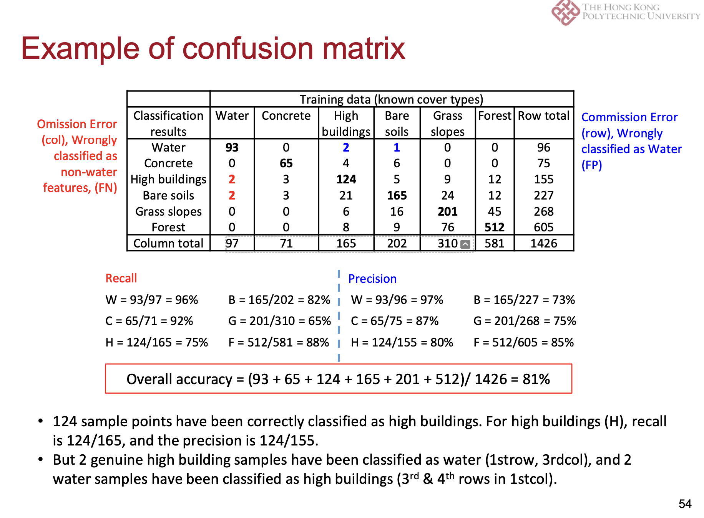

# Lecture 5 Remote Sensing Image Interpretation

## Section 1 Image Classification & Machine Learning

### Image classification
- Land Use refers to what people do on the land surface (e.g., agriculture, commerce, settlement)
- Land Cover refers to the type of material present on the landscape (e.g., water, sand, crops, forest, wetland, human-made materials such as asphalt)


### Machine learning
- Think about tremendous size of remote sensing images available from the Internet (e.g. 50 years of Landsat images), this deluge of data calls for automated methods of data analysis, which is what Machine Learning provides.
- Machine Learning is a set of methods that can automatically detect patterns in data (given image), and then use the uncovered patterns to predict future data (new image), or to perform other kinds of decision making under uncertainty (such as planning how to collect more data)

## Section 2 Supervised Classification
- There are four distinct stages:
  - Date preparation
  - Training – Require splitting sample data into training sample and test sample.
  - Classification – Select and apply model and algorithm
  - Output

### Several different Supervised Classification approaches:
1. k-Nearest Neighbour Classifier (k-NN)
    - No model to be fit.
    - Given a query point x, find k training points closet to x and classify using majority vote among the k neighbours.
    - If k=1, training error rate is 0, but test error may be quite high.
    - Distance metric Euclidean distance.
2. Minimum Distance to Means Classifier (MDM)

   - Classified by minimum distance between unknown pixel and each of the category means.
   - May define a distance, if unknown pixel is farther than that, classified as unknown.
   - Insensitive to different degrees of variance, i.e. pixel 2 is closed to mean of “S” but it is within variability of “U”.

3. Maximum Likelihood Classifier (MLC)
   1. 不只考虑均值中心，还考虑相关性矩阵 covariance matrix

    - Assumption of normality
    - As we know distribution of the features, each can be described in terms of a Gaussian density, which has a mean vector and a covariance matrix.
    - Given the parameters, it can be used to compute the probability of a given pixel being a member of a particular land cover class.
    - Since a pixel can be a member of different classes at different degree, meaning clusters may overl
  
## Section 3 Unsupervised Classification
- Unsupervised classification
  - Examine all bands for each pixel in an image - the process is iterative.
  - Aggregate them into a number of classes based on natural groupings or clusters present in the image values.
  - Result in spectral classes (clusters) and initially, their identities are unknown.
  - Each class is then identified from knowledge or reference data.
  - Operator intervention only after data has been placed into classes.

- K-means
  - It is a method for finding clusters and cluster centers in a set of unlabeled data.
  - One chooses the desired number of cluster centers, say R, and the K-means procedure iteratively moves the centers to minimize the total variance within cluster. It is an iterative procedure.
  - K-means works best for spherical cluster with same variance but elongated / oval cluster (larger variability).
  - Use elbow method to determine k value.

- ISODATA
  - Iterative Self-Organizing Data Analysis Technique (ISODATA) is an unsupervised classification
  - calculates class means evenly distributed in the data space then iteratively clusters the remaining pixels using the minimum distance techniques.
  - No need to know the number of clusters prior
  - Similar to k-means but it adds more operations to refine the classification result, e.g., split and merge.
  - ```
    • Cluster centers are randomly placed and pixels are assigned based on the shortest distance to center
    • The standard deviation within each cluster, and the distance between cluster centers is calculated. 
        • Clusters are split if one or more standard deviation is greater than the user-defined threshold.
        • Clusters are merged if the distance between them is less than the user-defined threshold.
    • Adjust cluster centers based on pixel assignment
    • Further iterations until
        • Average inter-center distance falls below user-defined threshold
        • Average change in the inter-center distance between iterations is less than a threshold, or
        • The maximum number of iterations is reached
    ```
  - Disadvantage:
    - Time consuming if data is very unstructured.
  - Advantages:
    - Treat as a black box
    - Little user effort
    - Effective at identifying spectral clusters in data. 

## Section 4 Accuracy Assessment
- Accuracy assessment
   - Error matrix (or confusion table, confusion matrix)
   - Comparison of the relationship between known reference data and the corresponding results of an automated classification
   - It is common to average the correct classifications and regard this as the overall classification accuracy
- TP, TN, FP, FN
    | \ | Predicted No | Predicted Yes |
    | --- | --- | --- |
    | Actual No | TN | FP |
    | Actual Yes | FN | TP |
- Accuracy Matrix
    - Overall accuracy = (TP + TN) / (TP + TN + FP + FN)
    - Producer’s accuracy = TP / (TP + FN)
    - User’s accuracy = TP / (TP + FP)
    - Kappa coefficient = (Po - Pe) / (1 - Pe)
    - Po = (TP + TN) / (TP + TN + FP + FN)
    - Pe = ((TP + FP) * (TP + FN) + (FP + TN) * (FN + TN)) / (TP + TN + FP + FN)^2
- 
