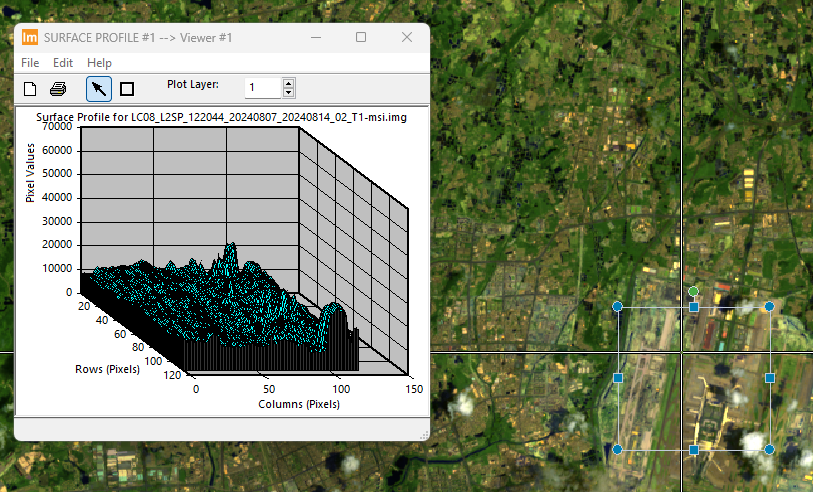

# Part1

> LSGI536-Lab1-24037665g-PanZhiQing

## Introduction for Part1

You need to download a satellite image, then present it using ERDAS IMAGINE software. The image attribute, spectral profile, surface profile, and spatial profile are required to be shown in the report. 

## Spectral profile

Figure 1: Spectral profile of the image

## Surface profile

Figure 2: Surface profile of the image
## Spatial profile

Figure 3: Spatial profile of the image

## Image attribute
<!--  -->
<!-- 保留愿比例 缩减到80% -->

Figure 4: Image attribute of the image
## Reference
1. [data set](https://earthexplorer.usgs.gov/scene/metadata/full/5e83d14f2fc39685/LC81220442024220LGN00/)

# Part 2

## Introduction for Part2
You need to register the image with map and image with image, respectively, using the dataset in the ‘data’ folder. Then export two maps of the registered images with ArcGIS software (overlay the registered image and reference road map, registered image and reference image separately).

## Image to map registration

## Image to image registration
