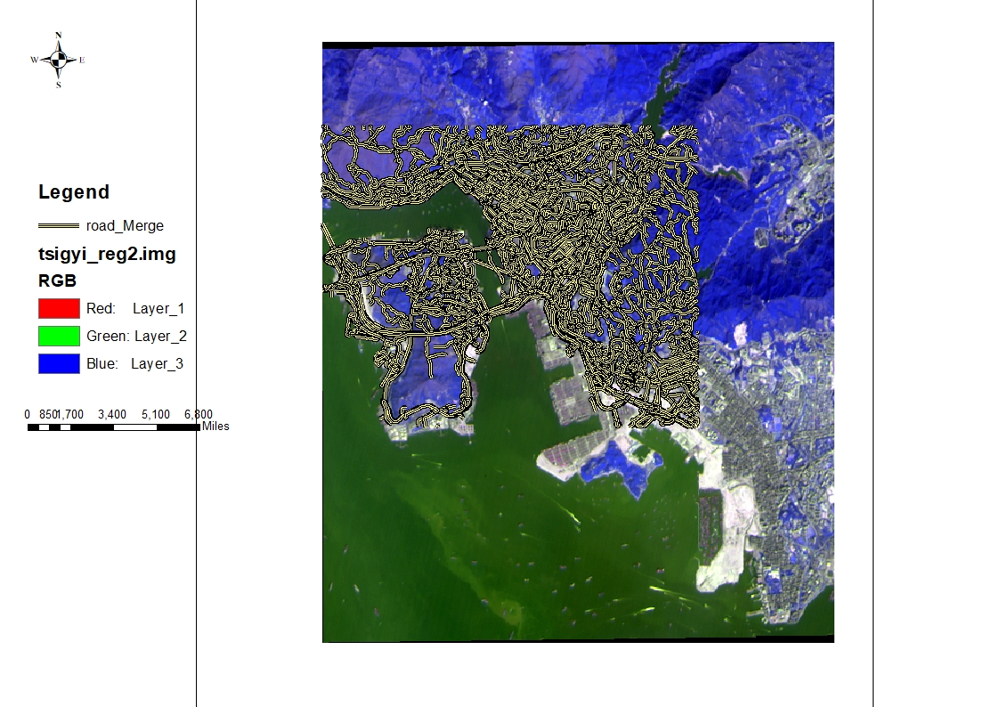

# Part 2

## Introduction for Part2
You need to register the image with map and image with image, respectively, using the dataset in the ‘data’ folder. Then export two maps of the registered images with ArcGIS software (overlay the registered image and reference road map, registered image and reference image separately).

## Image to map registration

## Image to image registration
