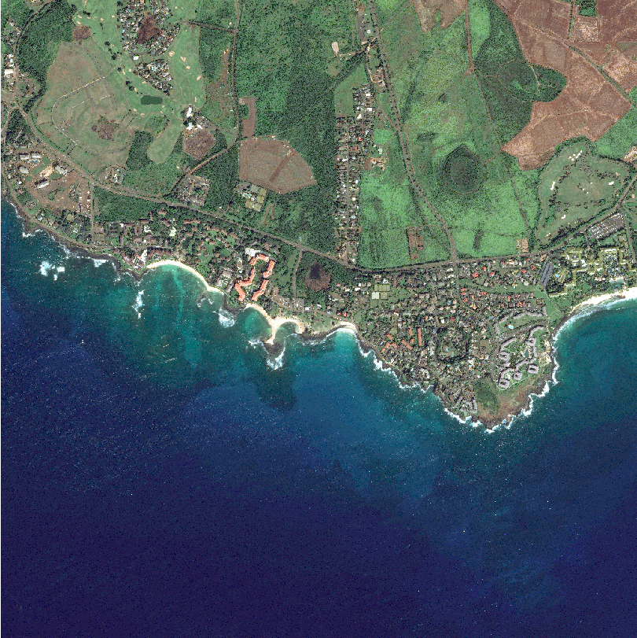

#
## Part1

> LSGI536-Lab1-24037665g-PanZhiQing

### 1. For radiometric correction:
Create a graph of the Spectral Radiance for these features. Write down approximately 10-pixel values for each type of feature.

|\| Band 1 0.5-0.59 | Band 2 0.61-0.68 | Band 3 0.79-0.89 |
|---|---|---|---|
|Vegetation| - | - | - |
|Soil| - | - | - |
|Water| - | - | - |
|Urban| - | - | - |

- In EXCEL or on graph paper create a curve for each feature (you will only have 3 points on each curve as SPOT is not a hyperspectral sensor).
- Get the Max, Min, Mean and SD values for each box in the above table.
INPUT1/(1.43194*POW(1.3,2))

#### Vegetation

| Sample id | Band 1 | Band 2 | Band 3 |
|---|---|---|---|
| 1 | 87 | 15 | 0 |
| 2 | 105 | 19 | 0 |
| 3 | 98 | 17 | 0 |
| 4 | 89 | 18 | 0 |
| 5 | 95 | 13 | 0 |
| 6 | 81 | 11 | 0 |
| 7 | 70 | 14 | 0 |
| 8 | 131 | 12 | 0 |
| 9 | 86 | 9 | 0 |
| 10 | 80 | 15 | 0 |

#### Soil

| Sample id | Band 1 | Band 2 | Band 3 |
|---|---|---|---|
| 1 | 60 | 70 | 11 |
| 2 | 59 | 73 | 20 |
| 3 | 27 | 52 | 4 |
| 4 | 50 | 71 | 19 |
| 5 | 58 | 65 | 8 |
| 6 | 49 | 73 | 14 |
| 7 | 61 | 68 | 8 |
| 8 | 67 | 71 | 18 |
| 9 | 79 | 84 | 16 |
| 10 | 58 | 66 | 8 |

#### Water

| Sample id | Band 1 | Band 2 | Band 3 |
|---|---|---|---|
| 1 | 0 | 8 | 0 |
| 2 | 0 | 6 | 0 |
| 3 | 0 | 4 | 0 |
| 4 | 2 | 3 | 0 |
| 5 | 0 | 5 | 0 |
| 6 | 0 | 5 | 0 |
| 7 | 0 | 13 | 0 |
| 8 | 0 | 3 | 0 |
| 9 | 0 | 8 | 0 |
| 10 | 0 | 14 | 0 |
#### Urban

| Sample id | Band 1 | Band 2 | Band 3 |
|---|---|---|---|
| 1 | 24 | 24 | 0 |
| 2 | 14 | 37 | 0 |
| 3 | 26 | 23 | 0 |
| 4 | 14 | 28 | 0 |
| 5 | 34 | 45 | 0 |
| 6 | 20 | 33 | 0 |
| 7 | 25 | 32 | 0 |
| 8 | 48 | 39 | 0 |
| 9 | 31 | 44 | 0 |
| 10 | 55 | 50 | 0 |

### 2. For contrast enhancement:
- Use contrast enhancement to highlight the water quality and conditions around Hong Kong and Lamma islands on a 3-band SPOT image 

– you can use the whole image or zoom in on a smaller area for your exercise. Use either a Default Transform supplied on the Transform menu OR create a user transform by dragging the transform line, according to the spectral characteristics of water in each band.

Hand in: 

- Write a paragraph to describe which features in the ocean areas the enhancement allows you to interpret. Illustrate this by including an enhanced image in the document. 
- Write the other paragraph for each band to describe the stretch used and explain how it works to improve the interpretability of water. 

- Insert the relevant Transform Histogram into the document. Reference to the graph of Coincident Spectral Plots may also help.

## Part2
- Conduct spatial filtering on the given image with three types of filters (at least one filter for each type), and save the screen captures of the results. 
- Describe the differences found before and after applying the spatial filtering.

### 1. Low-pass filter Smoothing 5x5

For the low-pass filter, the image is blurred and the edges are smoothed. The original image has some high-light spots, especially in the water area, which are removed after applying the filter. The image becomes more uniform and the details are less clear. For the color, I find the color of this image becomes more yellowish after applying the filter, especially in the farmland area, just like some old photos. 

### 2. High-pass filter Sharpening 3x3

When it comes to the high-pass filter, the image becomes noisier and the edges are enhanced. I find the edges of the road between the farmland and the ocean, the road in the farmland, and the edges of the farmland are more clear after applying the filter. The other areas become noisier and the details(or noise) are over-enhanced. Irrigular color blocks appear around the whole image.

### 3. Edge detection filter Laplacian 5x5

I chose the Laplacian filter 5*5 for edge detection. The Laplacian filter result is clear than the high-pass filter(Sharpening 3 * 3). In another word, the noise is less than the high-pass filter. However, the edges are not as clear as the high-pass filter, especially the long road between the farmland and the ocean. From my point of view, the Laplacian filter is more specific for local range edge detection, while the high-pass filter is more general for the whole image edge enhancement.