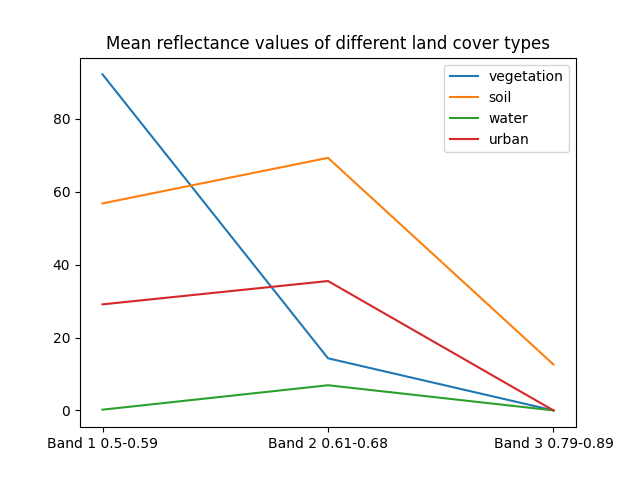
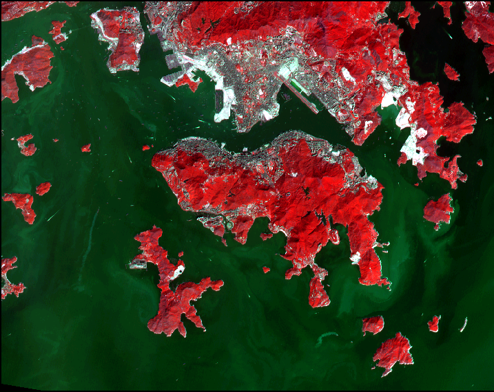
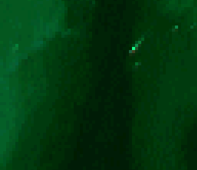
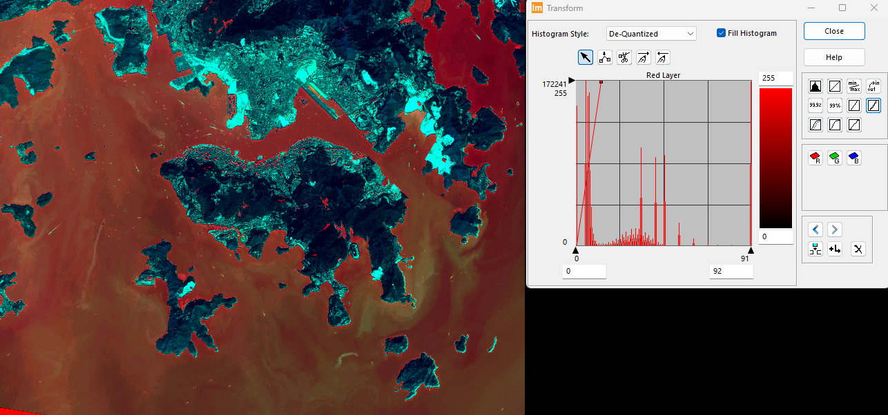
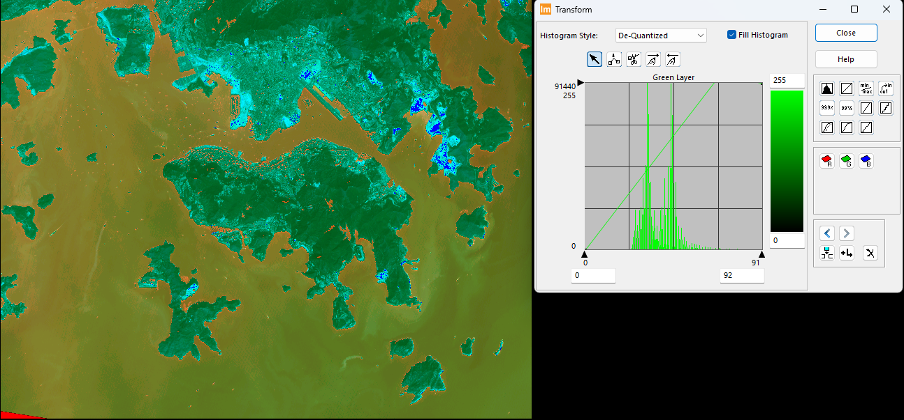
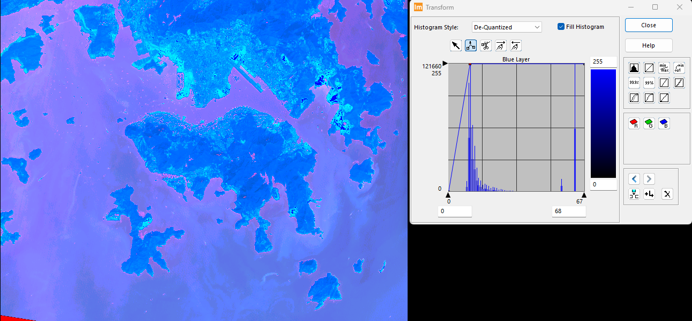
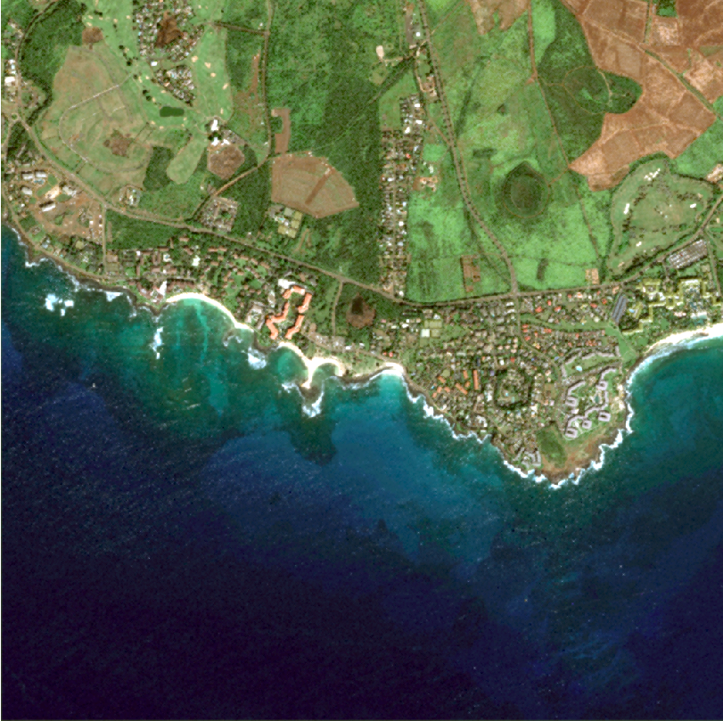
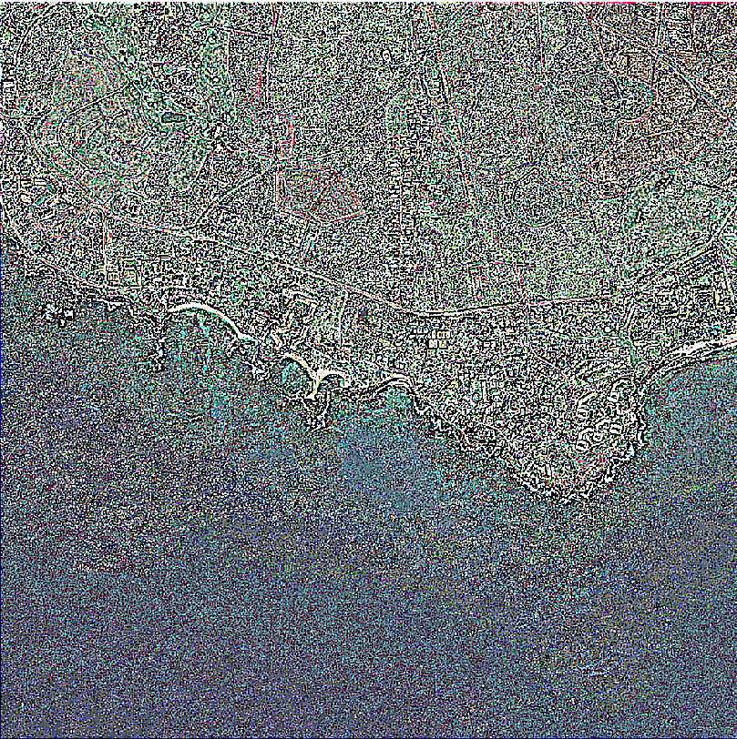
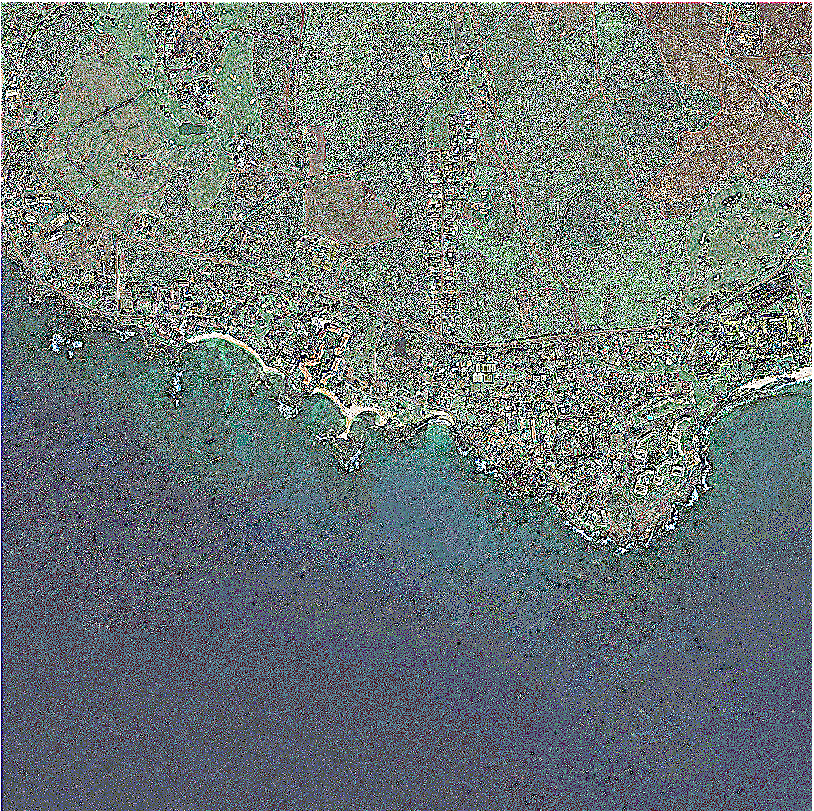

# Lab Exercise 2
> LSGI536-Lab2-24037665g-PanZhiQing
- [Lab Exercise 2](#lab-exercise-2)
  - [Part1](#part1)
    - [1. For radiometric correction:](#1-for-radiometric-correction)
    - [2. For contrast enhancement:](#2-for-contrast-enhancement)
  - [Part2](#part2)
  - [Appendix](#appendix)
    - [Vegetation](#vegetation)
    - [Soil](#soil)
    - [Water](#water)
    - [Urban](#urban)

## Part1
### 1. For radiometric correction:
Create a graph of the Spectral Radiance for these features. Write down approximately 10-pixel values for each type of feature.

| \\ | Band 1 0.5-0.59 | Band 2 0.61-0.68 | Band 3 0.79-0.89 |
|---|---|---|---|
|Vegetation| Min: 70, Max: 131, Mean: 92.2, SD: 16.84 | Min: 9, Max: 19, Mean: 14.3, SD: 3.16 | Min: 0, Max: 0, Mean: 0, SD: 0 |
|Soil| Min: 27, Max: 79, Mean: 56.8, SD: 13.45 | Min: 52, Max: 84, Mean: 69.3, SD: 8.03 | Min: 4, Max: 20, Mean: 12.6, SD: 5.56 |
|Water| Min: 0, Max: 2, Mean: 0.2, SD: 0.63 | Min: 3, Max: 14, Mean: 6.9, SD: 3.9 | Min: 0, Max: 0, Mean: 0, SD: 0 |
|Urban| Min: 14, Max: 55, Mean: 29.1, SD: 13.53 | Min: 23, Max: 50, Mean: 35.5, SD: 9.13 | Min: 0, Max: 0, Mean: 0, SD: 0 |

Figure 1: Mean Spectral Radiance for different features(vegetation, soil, water, urban) in SPOT image.

### 2. For contrast enhancement:

For the contrast enhancement, I think the visibility of the water is a key indicator. By brightening the water and creating a grayscale layer, the depth of the water can be effectively displayed.

Figure 2: Contrast enhancement for water quality and conditions around Hong Kong and Lamma islands.

When we check the local image, we can find that at least 5 levels can be distinguished from the darkest to the brightest. Here we can assume that the brighter part is mainly due to the shallow water reflection, which means poor water quality or shallow water. The darker part may be due to the deep water reflection, which means that sunlight entering the deep water is directly absorbed and rarely reflected back, indicating good water quality and deep water. Such a layering can help us better understand the depth distribution of water bodies and thus better assess water quality.

Figure 3: Local image for water quality and conditions around Hong Kong and Lamma islands.

So, the main goal of image enhancement is to enhance this layering effect so that we can better observe the depth distribution of water bodies and thus better assess water quality.

The red band has an obvious small reflection peak on the left side of the histogram. I choose to manually stretch the histogram so that this small reflection peak can be better displayed.

Figure 4: Contrast enhancement for water quality and conditions around Hong Kong and Lamma islands in Band 1.

For the green band, I choose to lower the brightness of the non-water part so that the reflection of the water part is more obvious.

Figure 5: Contrast enhancement for water quality and conditions around Hong Kong and Lamma islands in Band 2.

For the blue band, the water also has an obvious small reflection peak on the left side of the histogram. I choose similar operations to the red band.

Figure 6: Contrast enhancement for water quality and conditions around Hong Kong and Lamma islands in Band 3.

## Part2

| Filter Type | Filter Name&Size | Image |
|---|---|---|
| Low-pass filter | Smoothing 5x5 |  | 
| High-pass filter | Sharpening 5x5 |  | 
| Edge detection filter | Laplacian 5x5 |  | 

- Low-pass filter: The image is blurred and the edges are smoothed. The original image has some high-light spots, especially in the water area, which are removed after applying the filter. The image becomes more uniform and the details are less clear. For the color, I find the color of this image becomes more yellowish after applying the filter, especially in the farmland area, just like some old photos.
- High-pass filter: When it comes to the high-pass filter, the image becomes noisier and the edges are enhanced. I find the edges of the road between the farmland and the ocean, the road in the farmland, and the edges of the farmland are more clear after applying the filter. The other areas become noisier and the details(or noise) are over-enhanced. Irrigular color blocks appear around the whole image.
- Edge detection filter: I chose the Laplacian filter 5*5 for edge detection. The Laplacian filter result is clear than the high-pass filter(Sharpening 5 * 5). In another word, the noise is less than the high-pass filter. However, the edges are not as clear as the high-pass filter, especially the long road between the farmland and the ocean. From my point of view, the Laplacian filter is more specific for local range edge detection, while the high-pass filter is more general for the whole image edge enhancement.

## Appendix
### Vegetation

| Sample id | Band 1 | Band 2 | Band 3 |
|---|---|---|---|
| 1 | 87 | 15 | 0 |
| 2 | 105 | 19 | 0 |
| 3 | 98 | 17 | 0 |
| 4 | 89 | 18 | 0 |
| 5 | 95 | 13 | 0 |
| 6 | 81 | 11 | 0 |
| 7 | 70 | 14 | 0 |
| 8 | 131 | 12 | 0 |
| 9 | 86 | 9 | 0 |
| 10 | 80 | 15 | 0 |

        Sample id    \tBand 1   \tBand 2  \tBand 3
    count   10.00000   10.000000  10.000000      10.0
    mean     5.50000   92.200000  14.300000       0.0
    std      3.02765   16.844386   3.164034       0.0
    min      1.00000   70.000000   9.000000       0.0
    25%      3.25000   82.250000  12.250000       0.0
    50%      5.50000   88.000000  14.500000       0.0
    75%      7.75000   97.250000  16.500000       0.0
    max     10.00000  131.000000  19.000000       0.0
### Soil

| Sample id | Band 1 | Band 2 | Band 3 |
|---|---|---|---|
| 1 | 60 | 70 | 11 |
| 2 | 59 | 73 | 20 |
| 3 | 27 | 52 | 4 |
| 4 | 50 | 71 | 19 |
| 5 | 58 | 65 | 8 |
| 6 | 49 | 73 | 14 |
| 7 | 61 | 68 | 8 |
| 8 | 67 | 71 | 18 |
| 9 | 79 | 84 | 16 |
| 10 | 58 | 66 | 8 |

        Sample id   \tBand 1   \tBand 2   \tBand 3
    count   10.00000  10.000000  10.000000  10.000000
    mean     5.50000  56.800000  69.300000  12.600000
    std      3.02765  13.447842   8.028422   5.561774
    min      1.00000  27.000000  52.000000   4.000000
    25%      3.25000  52.000000  66.500000   8.000000
    50%      5.50000  58.500000  70.500000  12.500000
    75%      7.75000  60.750000  72.500000  17.500000
    max     10.00000  79.000000  84.000000  20.000000
### Water

| Sample id | Band 1 | Band 2 | Band 3 |
|---|---|---|---|
| 1 | 0 | 8 | 0 |
| 2 | 0 | 6 | 0 |
| 3 | 0 | 4 | 0 |
| 4 | 2 | 3 | 0 |
| 5 | 0 | 5 | 0 |
| 6 | 0 | 5 | 0 |
| 7 | 0 | 13 | 0 |
| 8 | 0 | 3 | 0 |
| 9 | 0 | 8 | 0 |
| 10 | 0 | 14 | 0 |

        Sample id   \tBand 1   \tBand 2  \tBand 3
    count   10.00000  10.000000  10.000000      10.0
    mean     5.50000   0.200000   6.900000       0.0
    std      3.02765   0.632456   3.900142       0.0
    min      1.00000   0.000000   3.000000       0.0
    25%      3.25000   0.000000   4.250000       0.0
    50%      5.50000   0.000000   5.500000       0.0
    75%      7.75000   0.000000   8.000000       0.0
    max     10.00000   2.000000  14.000000       0.0
### Urban

| Sample id | Band 1 | Band 2 | Band 3 |
|---|---|---|---|
| 1 | 24 | 24 | 0 |
| 2 | 14 | 37 | 0 |
| 3 | 26 | 23 | 0 |
| 4 | 14 | 28 | 0 |
| 5 | 34 | 45 | 0 |
| 6 | 20 | 33 | 0 |
| 7 | 25 | 32 | 0 |
| 8 | 48 | 39 | 0 |
| 9 | 31 | 44 | 0 |
| 10 | 55 | 50 | 0 |

        Sample id   \tBand 1   \tBand 2  \tBand 3
    count   10.00000  10.000000  10.000000      10.0
    mean     5.50000  29.100000  35.500000       0.0
    std      3.02765  13.527339   9.131752       0.0
    min      1.00000  14.000000  23.000000       0.0
    25%      3.25000  21.000000  29.000000       0.0
    50%      5.50000  25.500000  35.000000       0.0
    75%      7.75000  33.250000  42.750000       0.0
    max     10.00000  55.000000  50.000000       0.0